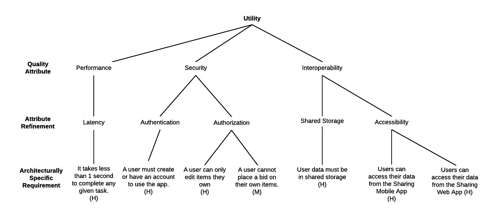

# Capstone Assignment 3.3 – Architecture Analysis and Evaluation

## Introduction

This repository contains materials for Capstone Assignment 3.3, which involves the analysis and evaluation of an architecture. The objective is to assess the current architecture and design of a given system to inform decisions regarding its future development. By identifying potential risks and quality attributes, we aim to ensure the system's viability, usability, and maintainability.

## Assignment Guidelines

### Review of Lectures

Before proceeding with the assignment, it's essential to review the following lectures:

- **Lecture 3.3.1 - Quality Attributes**
- **Lecture 3.3.2 - Analyzing and Evaluating Architecture**

### Assignment Tasks

1. **Understanding the System**: Evaluate the architecture and design of the provided system to determine its strengths, weaknesses, and areas for improvement.

2. **Identifying Risks**: Identify potential risks that the system may face, which could impact end users or developers. Consider factors such as usability, maintainability, and scalability.

3. **Quality Attribute Scenarios**: Review the provided Quality Attribute Scenarios from various perspectives. Determine if each scenario represents a risk, non-risk, tradeoff, or sensitivity point in the application's architecture.

4. **Update Utility Tree**: Make necessary updates to the Attribute Utility Tree based on the identified scenarios. This includes adding quality attributes, refining attribute details, and adjusting priorities to reflect the evaluation findings.

## Getting Started

### Files Provided

- **Attribute Utility Tree**: Initial Utility Tree highlighting Architecturally Significant Requirements (ASRs) of the current system version.

  - 

- **Quality Attribute Scenarios**: Document containing various scenarios to evaluate the architecture of the app.
  - [Quality Attribute Scenarios.pdf](Quality%20Attribute%20Scenarios.pdf)

### Assignment Execution

1. Review the provided materials, including the Attribute Utility Tree and Quality Attribute Scenarios document.
2. Analyze each Quality Attribute Scenario to determine its impact on the system architecture.
3. Classify each scenario as a risk, non-risk, tradeoff, or sensitivity point, providing a brief explanation for each (3 sentences or less).
4. Update the Attribute Utility Tree to reflect the identified scenarios, making necessary adjustments and additions.
5. Ensure that the Utility Tree accurately represents the current state of the system architecture and its associated risks and priorities.

## Conclusion

By completing this assignment, we aim to gain a comprehensive understanding of the system's architecture and its implications for future development. Through thoughtful analysis and evaluation of quality attributes, we can make informed decisions to enhance the system's overall quality and effectiveness.
