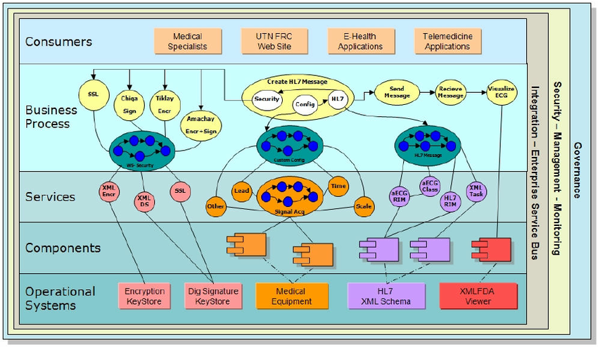

## Course 4 - Service-Oriented Architecture Journey

This module serves as a foundational step towards understanding the principles and technologies that drive SOA. This module, have a solid grasp of the fundamental concepts behind service-oriented architectures and the technologies that underpin the World Wide Web.

# Course Details

## A Service Oriented Methodology

- **Introduction to a SOA adoption roadmap**
- **Service lifecycle**
- **Three analysis approaches**
  - Service oriented analysis
  - Service oriented design
  - Introduction to service oriented patterns

## Advantages of SOA

- **Traditional EAI Approach**
- **Problems With Traditional EAI Approach**
- **Enter Service Oriented Architecture (SOA)**
- **Build the Services**
- **We Can Easily Change the Process**
- **Change Flow Using Legacy Approach**
- **Replacing an Application**
- **Other Advantages**
- **Business Advantages**
- **Adoption Stages**

## SOA Past and Present

- **From XML to Web Service to SOA**
- **How SOA was done before**
- **Emerging standards for SOA**
- **Compare SOA with other architectures**

## What is service oriented architecture?

- **What is SOA?**
- **Creating a common understanding of SOA**
- **The evolution of SOA**
- **Introduce the concepts of services and SOA**
- **Design principles of SOA**
- **The relationship between SOA and web services**
- **The advantages and risks of SOA**

## Introduction to modelling and UML

- **Why use models with SOA.**
- **Difference between model and methodology.**
- **Why use the Unified Modeling Language?**
- **Introducing UML, the notation.**
- **Identifying business processes.**
- **Notation, Patterns and Methodology.**
- **Which Methodology to choose?**

## Fundamental Concepts

- **Building from components.**
- **Modeling concepts.**
- **What is an object?**
- **Containment.**
- **Messages and methods.**
- **Object interaction.**
- **Exercise: testing some basic concepts.**

## Introduction to Business Process

- **How a collection of services perform a task.**
- **Simple request response interaction**
- **Complex interaction involving many services.**
- **Need for a coordinator service emerges.**
- **Birth of orchestration or business process.**
- **Composing processes using processes.**
- **Business Process Execution Language (BPEL)**
- **Example business processes**

## Service Enablement

- **Basic web services elements**
- **Core web services standards stack**
- **The Importance of WSDL**
- **The design of SOAP**
- **The use of registries via UDDI**
- **The basic concepts of service orientation**

## Distributing Services Across a Network

- **Aligning functional and nonfunctional requirements**
- **The role of Intermediaries In Service Networks**
- **Introductions to WS-\* Extensions**
- **SOA Tenets**

## Modeling SOA building blocks

- **Using UML to analyze and design interfaces**
- **Generating a domain model**
- **Implementing and realizing Use Cases**
- **Showing web service collaboration**
- **Usage of communication diagrams**

## Enterprise Service Bus (ESB)

- **Objectives**
- **Service Invocation**
- **Legacy System Integration**
- **Web Services to the Rescue**
- **The role of ESB in SOA**
- **Security and ESB**

## Process Driven Services

- **Service layer abstraction**
- **Introduction to business process layer**
- **Process patterns**
- **Orchestration and choreography**
- **The use WS-BPEL for process automation**

## A Service Oriented Reference Model

- **Reference models and reference architectures**
- **The IMPACT SOA reference model and architecture**
- **SOA vendors and their relationship with SOA**
- **SOA support in .NET and J2EE platforms**

## Layered Architecture

- **The layers pattern.**
- **Classic three-tier architecture.**
- **Connecting to the domain layer.**
- **Linking to the User interface.**
- **Using packages to decompose a system.**
- **Avoiding mutual dependencies.**
- **What is layering and why we need them?**
- **Application service layer**
- **Business service layer**
- **Orchestration service layer**

## Conclusions

- **The benefits of employing SOA**
- **Review of common business goals**
- **The risks associated with the SOA approach**
- **Evaluating tradeoff strategies**
